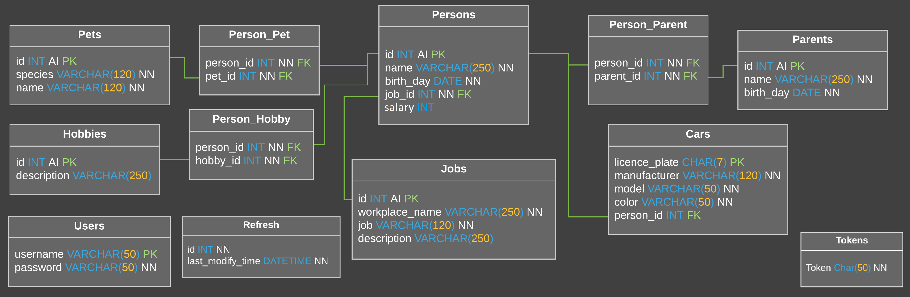
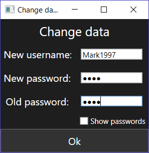
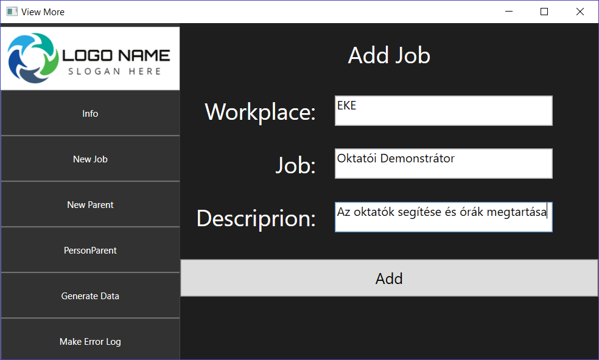
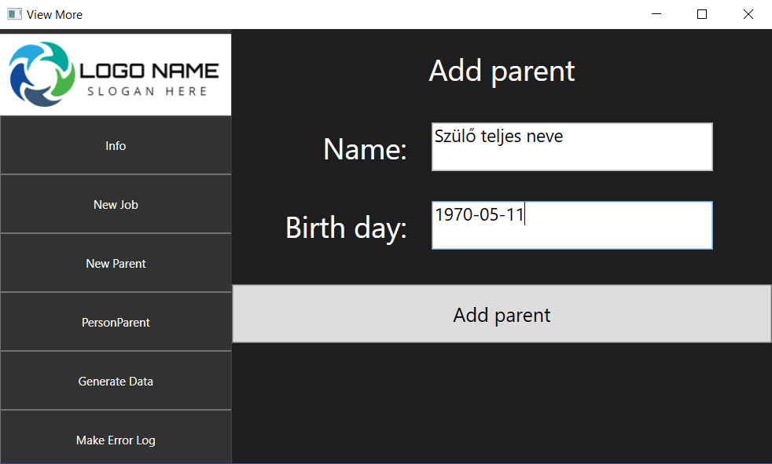
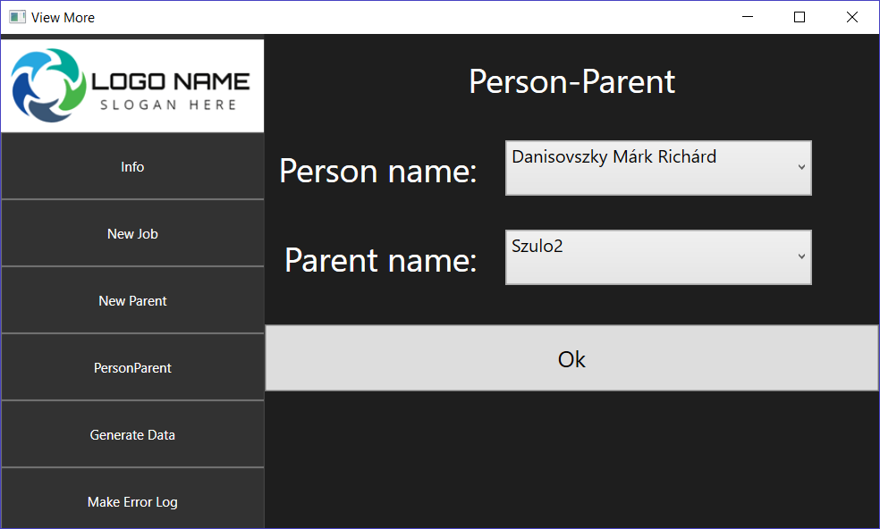

**Ez a projekt az Eszterházy Károly Egyetem SQL szerver programozás című tárgyhoz készített beadandó feladatom.**

Elhatároztam, hogy verziókövető rendszerrel fogom a verziókat követni és csak egy előre kidolgozott ütemterv illetve kellő tervezés után kezdek bele a fejlesztésbe.

Adatbázis: MSSQL
Architektúra: WCF
Kliens: WPF

Az egész projekt publikus.

**Az elkészült projekt bemutatása**

Használt elemek:

-Dinamikus felületek (C#-WPF)

-Cserélhető stílusok

-MVVM

-Logolás a felhasználói tevékenységről illetve a szerver üzeneteiről

-Hibanapló készítése

-WCF szolgáltatás, mely a kommunikációt biztosítja a kliens és az adatbázis között

-Tárolt eljárások az adatbázisban

-Adatbázis Trigger használata

-Felhasználói jelszavak titkosítása MD5 algoritmussal

-Token alapú azonosítás

-Automatikus frissítési lehetőség a módosítás ideje alapján

-Hibaszerződés a kliens és a szolgáltatások között

**Adatbázis**

Tervezett felépítése:

Tárolt eljárások:
-CanLogin
-DeletePerson
-DeletePersonConnection
-DeleteToken
-Identification
-InsertJob
-InsertPerson
-InsertToken
-Login
-Logout
-UpdateLastModifyTime
-UpatePerson
-UpdateUser

Triggerek:
A Person táblára vonatkozóan az alábbi műveletek végrehajtása után a szerver automatikusan frissíti a legutóbbi módosítás idejét. UPDATE, INSERT, DELETE

**Kliens felületeinek bemutatása**

Bejelentkező felület:

Felhasználó adatainak módosítása:

Dolgozók kezelésére szolgáló felület:

Dolgozó felvétele:

Dolgozó módosítása:

Dolgozó törlése:

Információs felület:

Új munka felvétele:

Szülő felvétele:

Szülő hozzárendelése munkáshoz:

Adatok generálása:

Hibanapló elkészítése:

